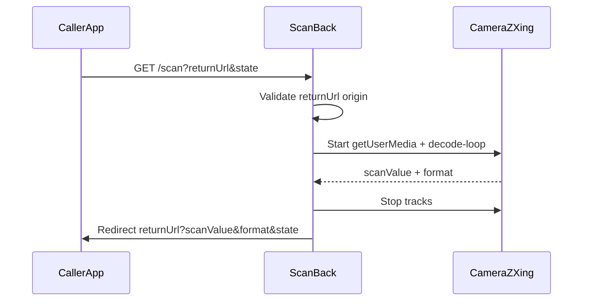

# ScanBack — mobile scanner with redirect return

Copy this plan to another agent. It is meant to be self-contained enough to build the app without prior chat context.

## Product goal

Build **ScanBack**: a **client-side** Angular web app (mobile-first) that:

1. Opens the camera and scans **QR codes and barcodes** (not OCR/text).
2. Can be opened from **other web apps**.
3. After a successful scan **redirects back** to the calling app with the scanned value in the URL.

No backend in v1. Everything runs in the browser.

## Name and location

- App name: **ScanBack**
- Folder: `/Users/benrei/git/github/purified-app/scan-back`
- The folder already exists and has a git repo — **do not** create a new folder or run `git init` again
- Use `cursor-app-control` MCP `move_agent_to_root` to this folder **before** scaffolding/changes (if the agent is running from home)
- Plan file for other agents: also save/copy as `PLAN.md` in the project root

## Stack (locked)

- **Angular** latest stable via CLI (`ng version` first; otherwise `npx @angular/cli@latest`)
- Standalone components, signals, modern Angular style
- Routing: `/` (landing/help) and `/scan` (scanner)
- Scanning: **ZXing** (`@zxing/browser` and/or `@zxing/ngx-scanner`)
- Styling: mobile-first, fullscreen camera view on `/scan`, simple landing
- UI language: **English**
- Deploy target: **GitHub Pages** (static, HTTPS out of the box — required for camera) — no SSR needed in v1
- Angular `baseHref` must match the Pages URL (e.g. `/scan-back/` for project pages, or `/` for custom domain / user site)
- Prefer **path routing** (`/scan`) with a `404.html` → `index.html` SPA fallback on Pages (not hash routing)

## Integration contract (core)

### Open the scanner

Calling app navigates (same tab or `location.href`) to:

```text
https://<scanback-host>/scan?returnUrl=<urlencoded-absolute-url>&state=<optional>&formats=<optional>
```

Parameters:


| Param       | Required                  | Description                                                                                 |
| ----------- | ------------------------- | ------------------------------------------------------------------------------------------- |
| `returnUrl` | yes for “return to caller” | Absolute `https:` URL that the scanner redirects to                                         |
| `state`     | no                        | Opaque string mirrored back unchanged (tie response to a field/form)                        |
| `formats`   | no                        | Comma-separated list, e.g. `QR_CODE,EAN_13,CODE_128`. Default: common QR + 1D barcodes       |


Without `returnUrl`: the scanner shows the result in the UI (standalone mode) with a copy button.

### Return after scan

Redirect to:

```text
<returnUrl>?scanValue=<urlencoded-value>&format=<format>&state=<state-if-provided>
```

Rules:

- One successful decode → stop camera → redirect immediately
- Keep existing query on `returnUrl` if any; merge `scanValue`/`format`/`state` (do not wipe caller params)
- On cancel (user taps Cancel): redirect with `error=cancelled` (+ `state` if set), or just `history.back()` if there is no safe `returnUrl`

### Security for `returnUrl`

- Allow only `https:` (plus `http://localhost` / `http://127.0.0.1` for local development)
- Reject `javascript:`, `data:`, relative URLs without origin
- Any https origin is allowed (no origin allowlist in v1)
- Do not rely on `document.referrer` alone

## App flow




## Screens / features

### `/` Landing

- Short explanation: “Scan a QR code or barcode and return to the app you came from”
- CTA: “Start scanning” → `/scan` (standalone)
- Short integration docs (URL contract) visible for developers

### `/scan` Scanner

- Fullscreen video preview (rear camera preferred: `facingMode: environment`)
- Visible reticle/overlay (simple, not overloaded with badges)
- Status: “Starting camera…” / “Point at the code” / error when permission missing
- Buttons: Cancel, Switch camera (if multiple devices)
- After a hit in standalone mode: show `scanValue` + `format`, buttons Copy / Scan again
- After a hit with a valid `returnUrl`: brief “Returning…” → redirect

### Error handling

- Camera permission denied → clear English error + tips (HTTPS, settings)
- Invalid `returnUrl` (bad scheme / not absolute https) → error, no redirect
- No camera found → error message

## Project structure (suggested)

```text
scan-back/
  PLAN.md                   # this plan (for other agents)
  README.md                 # contract + how to integrate
  src/app/
    app.routes.ts
    core/
      return-url.validator.ts
      scan-result.model.ts
    features/
      home/home.page.ts
      scan/scan.page.ts
      scan/scanner.service.ts
    shared/...
  public/ or src/assets/
```

- `ScannerService`: wrapper around ZXing + MediaStream lifecycle (start/stop, device switch)
- `ReturnUrlValidator`: parse + scheme checks + build redirect URL
- Keep scan logic out of the template; the component drives UI state with signals

## Demo caller (include in repo)

Create a minimal static/HTML or Angular route `/demo-caller` that:

1. Has an input field
2. A “Scan” button that navigates to `/scan?returnUrl=<current-origin>/demo-caller&state=demo1`
3. On return reads `scanValue` from the query and fills the field

This makes end-to-end testing possible without another app.

## README (must include)

- What ScanBack is
- Mobile + HTTPS requirements
- Open-URL and return-URL contract
- Return URL scheme rules
- How to run locally (`ng serve`)
- How to deploy to **GitHub Pages** (workflow + `base-href`)
- How another app integrates (2–3 line example)

## Deploy: GitHub Pages (easy in v1)

ScanBack is a pure static Angular build → fits GitHub Pages well.

- Build: `ng build --configuration production --base-href /scan-back/` (adjust `base-href` to repo name / custom domain)
- Publish `dist/.../browser` (or equivalent output) to a `gh-pages` branch, or use **GitHub Actions** (`actions/upload-pages-artifact` + `actions/deploy-pages`)
- Enable Pages in repo settings (Source: GitHub Actions or branch)
- HTTPS comes automatically → camera works on mobile without extra setup
- Caller apps must use the public Pages URL in the `returnUrl` flow
- Note: for Angular routing on Pages, use a `404.html` SPA fallback so deep links like `/scan` work on refresh
- Hash-based `returnUrl` values from caller apps are still supported by the redirect builder

Include a minimal `.github/workflows/deploy-pages.yml` in the repo that builds and deploys on push to `main`.

## Out of scope (v1)

- OCR / text recognition
- Popup / `postMessage` (mobile-first → redirect is enough)
- Backend, auth, user accounts
- Native app / Capacitor (can mention as a later option)
- PWA install as a requirement (optional later)

## Implementation order for the agent

1. Move workspace root to `/Users/benrei/git/github/purified-app/scan-back` (existing git repo)
2. Scaffold Angular app in this folder (routing, SCSS or CSS, no SSR). If the folder is not empty enough for `ng new`, scaffold in temp and move files in, or use `ng new .` with the existing-directory flag where supported
3. Ensure this plan exists as `PLAN.md` in the project root
4. Add ZXing dependency
5. Implement validator and models
6. Build `/scan` with camera + decode + stop + redirect/standalone
7. Build `/` landing + integration info
8. Build `/demo-caller` for manual E2E
9. Write README (incl. GitHub Pages)
10. Add GitHub Actions workflow for Pages deploy + correct `base-href` / routing fallback
11. Run `ng build` and fix errors
12. Short manual checklist: camera, QR, EAN/Code128 if possible, cancel, invalid returnUrl

## Acceptance criteria

- Mobile browser can scan QR and return `scanValue` to `returnUrl`
- `state` is mirrored unchanged
- Non-https / dangerous schemes do not redirect
- Without `returnUrl` the result is shown in the app
- Camera stream is stopped after scan / on destroy
- `ng build` succeeds
- App can be deployed to GitHub Pages via workflow (HTTPS, working `/scan` route)
